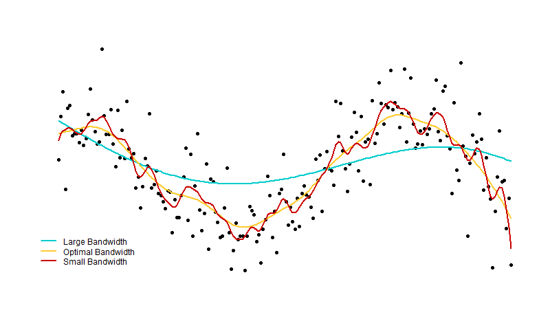

# looperr
An R Package for evaluating leave-one-out (loo) prediction error (perr).
Currently only works for local polynomial regression using a multivariate
Gaussian kernel and an arbitrary positive-definite bandwidth matrix.

Fast implementation in C++ using stable QR decomposition method.

# Use

```r
# Create some fake data
set.seed(1234)
n = 200
X = cbind(rep(1, n),seq(1,10, length.out=n))
y = sin(X[,2]) + rnorm(n, sd=0.5)

# Create 1x1 bandwidth matrices
H = list(matrix(2), matrix(0.3539426), matrix(0.1))

# Perform local linear regression with three bandwidth matrices
predvals = list()
for(i in 1:3){
  predvals[[i]] = loclin_gauss(X, H[[i]], y)$pred_vals
}

# Plot the local linear fits using base R graphics
plot(x=X[,2], y=y,
     axes=FALSE, xaxt="n", yaxt="n", ann=FALSE,
     pch=16, cex=0.9)
lines(X[,2], predvals[[1]], col="#00CCCC", lwd=2)
lines(X[,2], predvals[[2]], col="#FFCC33", lwd=2)
lines(X[,2], predvals[[3]], col="#CC0000", lwd=2)
legend(x=0.3,y=-1.5,
       legend=c("Big Bandwidth", "Optimal Bandwidth", "Small Bandwidth"),
       col=c("#00CCCC", "#FFCC33", "#CC0000"), lty=1, lwd=2, box.lty=0, bg=NA)
```


In this case, the optimal (yellow) bandwidth was selected by minimizing the LOOCV score

```r
optim(1, function(x) loocv(X, matrix(x), y), lower=0.1,upper=20, method="Brent")$par
```
