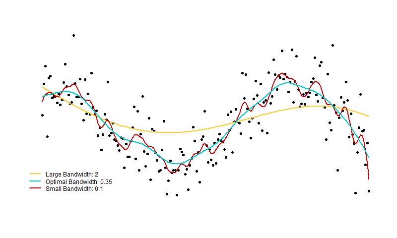

# looperr
An R Package for evaluating leave-one-out (loo) prediction error (perr)
of linear smoothers.
Currently methods include linear regression, local polynomial regression
with Gaussian or Epanechnikov kernel.

Fast implementation in C++ using stable QR decomposition method.



# Theory

# Usage
The main function of this package is `linsmooth()` which
performs a similar role to the standard `lm()` function for
regressions. The default is to run a local linear regression using
a Gaussian kernel. If your dataset is `X` and your response vector is `y`,
then the following few lines 

```r
# Local linear regression with optimal bandwidth
linsmooth(X, y)
# Local linear regression with bandwidth H=1
linsmooth(X, y, H=1)
# Weighted least squares regression with a vector of weights w
linsmooth(X, y, w, method="ols")
```

# Example

The figure at the top of this README was created using the following code:

```r
# Create some fake sinusoidal data
set.seed(1234)
n = 200
X = cbind(rep(1, n),seq(1,10, length.out=n))
y = sin(X[,2]) + rnorm(n, sd=0.5)
H = list(matrix(2), matrix(0.1))

# Perform local linear regression with three bandwidth matrices
predvals = list()
predvals[[1]] = linsmooth(X, y, H=2)    # Large bandwidth
predvals[[2]] = linsmooth(X, y, H=0.1)  # Small bandwidth
predvals[[3]] = linsmooth(X, y)         # Optimal bandwidth chosen for us

# Perform linear regression
predvals[[4]] = linsmooth(X, y, method="ols")

# Plot the local linear fits using base R graphics
png(filename="examples/looperr_example1.png", width=800, height=480)
plot(x=X[,2], y=y,
     axes=FALSE, xaxt="n", yaxt="n", ann=FALSE,
     pch=16, cex=0.9)
lines(X[,2], predvals[[1]]$fitted.values, col="#FFCC33", lwd=2)
lines(X[,2], predvals[[2]]$fitted.values, col="#CC0000", lwd=2)
lines(X[,2], predvals[[3]]$fitted.values, col="#00CCCC", lwd=2)

# Add a legend
legend(x=0.5,y=-1,
       legend=c("Large Bandwidth: 2" ,
                paste0("Optimal Bandwidth: ",
                       round(predvals[[3]]$bandwidth,2)),
                "Small Bandwidth: 0.1"),
       col=c("#FFCC33", "#00CCCC", "#CC0000"), lty=1, lwd=2, box.lty=0, bg=NA)
```

One can go further and easily analyze the leave-one-out prediction error point-by-point.
This is often more useful than analyzing residuals because a residual can be small
simply due to that point exerting high-leverage on the line of best fit. But
if you were to leave out that point from the regression, you might actually find
a large residual from the prediction of the response on the left out point.

TODO: compare residuals vs. prediction error.

# Setup and Installation

```r
devtools::install_github("harveybarnhard/looperr")
```
